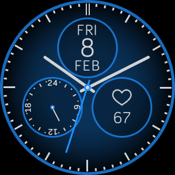

# fitbit-analog-stats
Fitbit analog clock face for Versa series watches

This is an analog clock face showing the day, date and month and a separate 24 hour hand. The stats dial on the lower right can be tapped to cycle between heart rate, active minutes, steps, distance, floors and calories burned. The colors of the hands, minute markers and background can be configured in the settings in the companion app. You can also set the transparency of the hands to better see the stats underneath.

