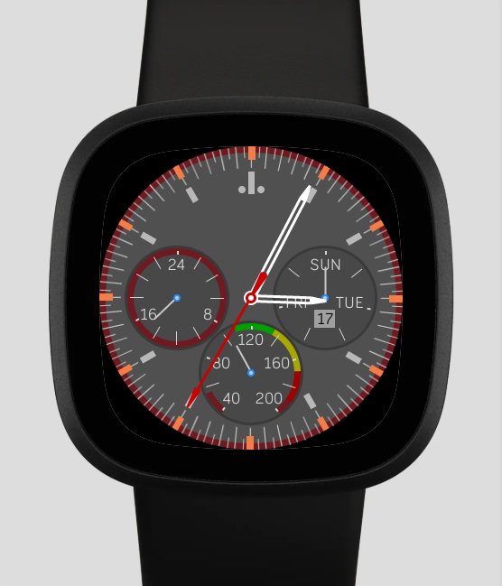

# fitbit-analog-watch-speedmaster
Fitbit analog clock face for Fitbit Versa 3 and Fitbit Sense watches using Fitbit SDK 3

This is an analog clock face that is a tribute to the classic [Omega Speedmaster](https://www.omegawatches.com/en-us/watches/speedmaster)
analog watches. This watch face shows the day, date and day of week,
a separate 24-hour hand is shared with the battery level. The heart rate dial on the 
bottom shows the current heart rate with a hand against a scale of the resting to maximum
heart rate, along with indicators for fat-burning, cardio and peak heart rates.

