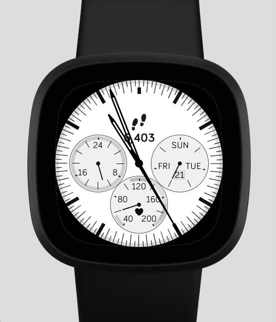
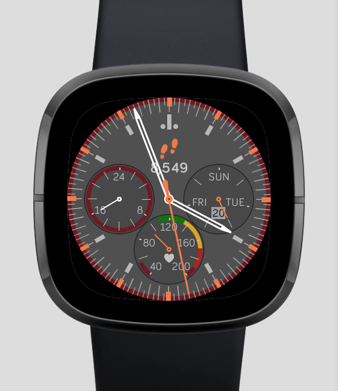
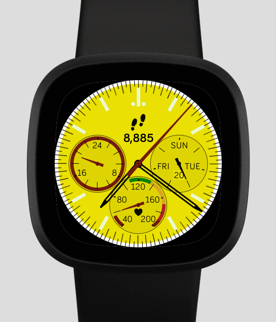
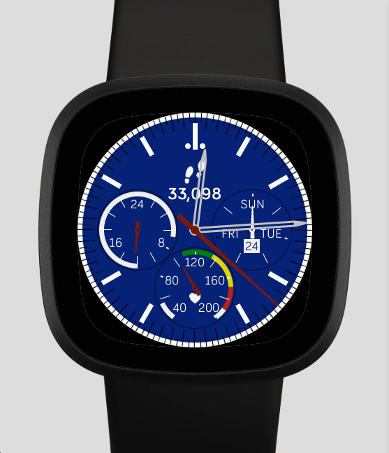
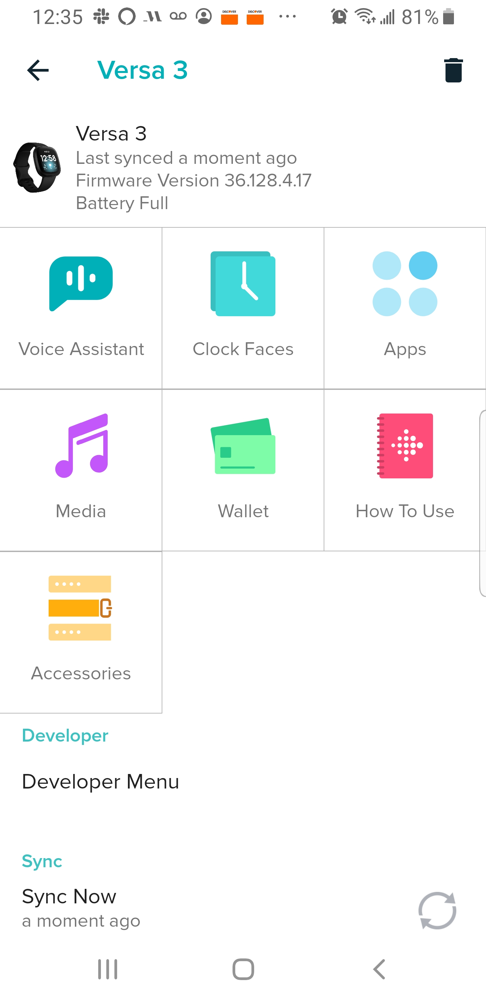
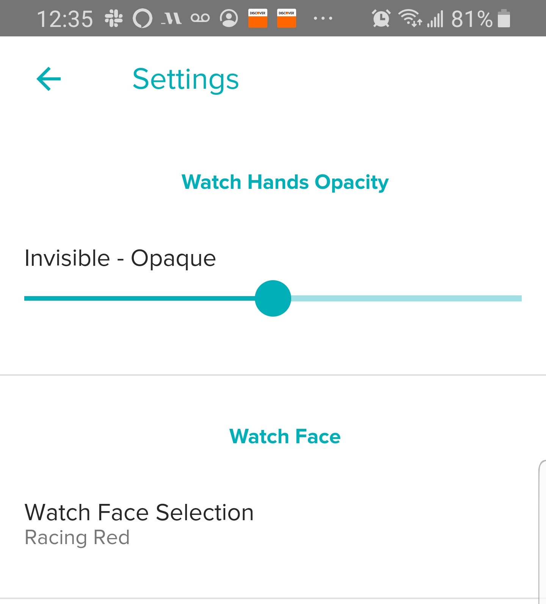

# Fitbit Muli-Dial Chronometer

## Contents
[Overview](#overview)
[Changing the Watchface Color](#changing-the-watchface-color)

## Overview

Fitbit analog clock face for Fitbit SDK 5.0 (Sense, Versa 3) and SDK 4.2 (Versa, Versa Lite, Versa 2).

This is an analog clock face that is a tribute to classic analog
multi-dial chronometers. This watch face shows the day, date and day of week,
a separate 24-hour hand is shared with the battery level. The heart rate dial on the 
bottom shows the current heart rate with a hand against a scale of the resting to maximum
heart rate, along with indicators for fat-burning, cardio and peak heart rates.

 &nbsp;   &nbsp;   &nbsp;   &nbsp;   &nbsp;   &nbsp;   &nbsp;   &nbsp;   &nbsp;   &nbsp;   &nbsp;   &nbsp;

## Changing the Watchface Color

